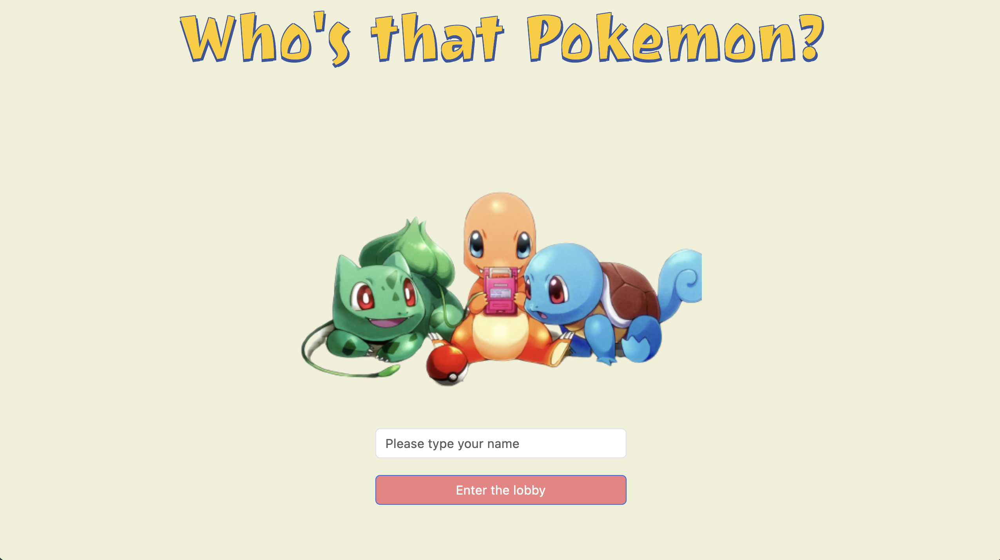
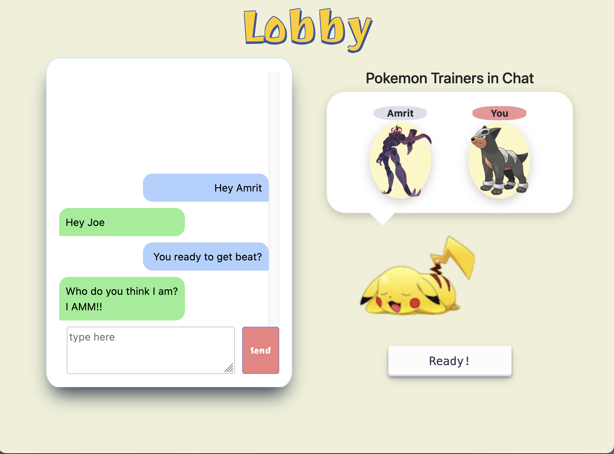
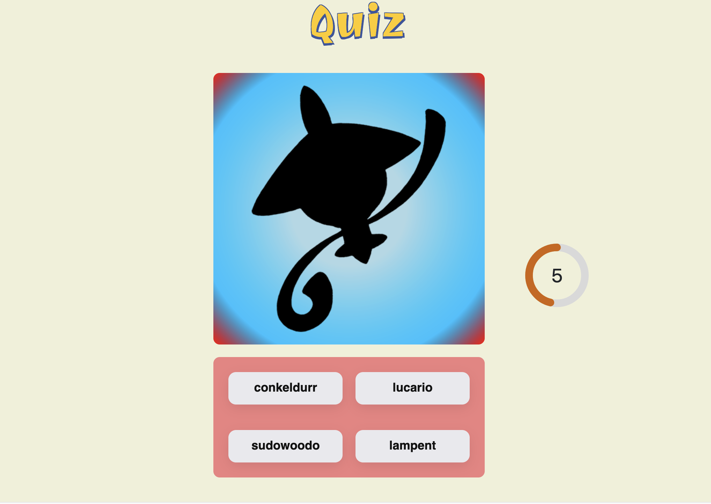
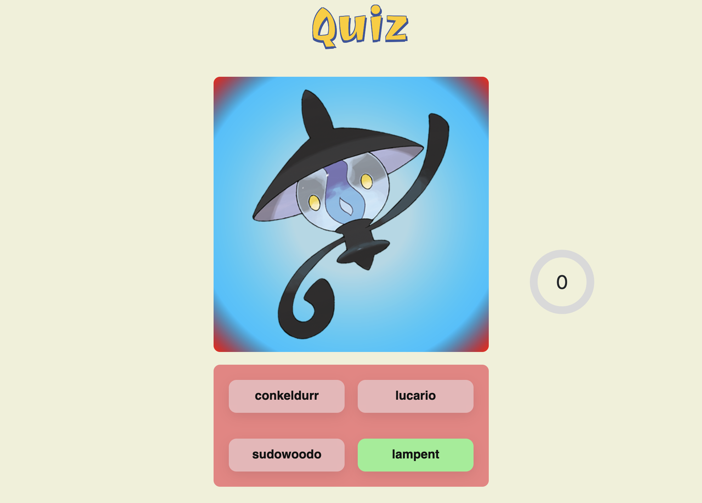
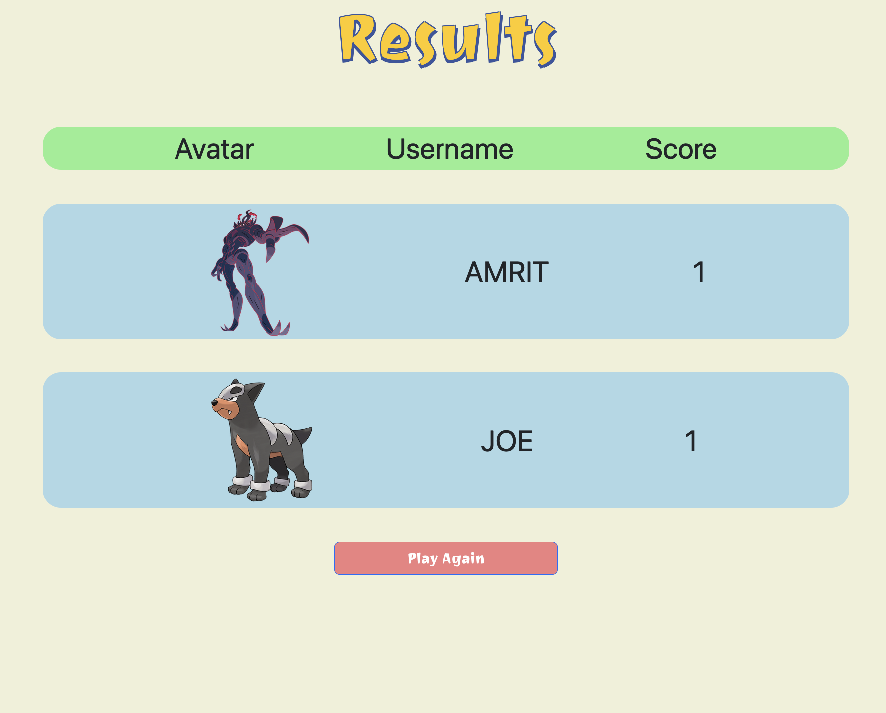

<h1>Online Multiplayer Pokemon Quiz</h1>
<h5>Live on: <a href="https://onlinepokequiz.web.app">https://onlinepokequiz.web.app</a></h5>

 Tools used: 

<ul>
<li>React</li>
<li>CSS</li>
<li>Bootstrap</li>
<li>Node.js</li>
<li>Express</li>
<li>Socket.io</li>
</ul>
<h2>Overview</h2>

Welcome to the Online Multiplayer Pokémon Quiz game inspired by the "Who's That Pokémon?" segment from the Pokémon TV series. Players can test their Pokémon knowledge, engage in synchronous gameplay with friends, and chat in-game.

<h2>Demo Pictures</h2>

  

   

  
 

  

<h2>Features</h2>
    <ul>
        <li><strong>In-game Chat:</strong> Engage with other players during the quiz.</li>
        <li><strong>Diverse Questions:</strong> Integrated with PokéAPI, the game offers a pool of 1000+ dynamically generated quiz questions, ensuring new challenges each time you play and increasing replay value.</li>
        <li><strong>Responsive UI:</strong> The user interface has been crafted using React.js for component logic and is styled with Bootstrap and CSS for a seamless user experience.</li>
        <li><strong>Robust Backend:</strong> Built on a Node.js/Express backend, the game handles game logic and score-keeping efficiently.</li>
        <li><strong>Synchronous Gameplay:</strong> Implemented with Socket.io, ensuring that players can play in real-time.</li>
    </ul>
